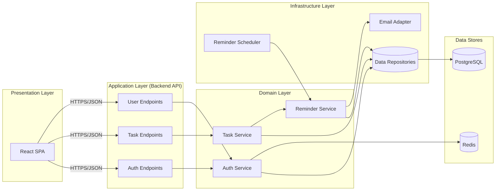

# 1. High-Level Design (HLD)

## 1.1 Purpose

Describe the overall structure of the Task Management Application at a level suitable for engineering leadership and cross-team review, before drilling into components, deployment, and data design.

## 1.2 Business Context

| Driver | Source |
|---|---|
| Improve personal productivity via reliable task tracking | BRD Section 2 |
| Reduce missed deadlines through reminders | BRD Section 2 |
| Keep each user's data private and isolated | BRD Section 2, FR-11, BR-05 |
| Provide a foundation extensible to collaboration/mobile later | BRD Section 2 |

## 1.3 System Overview

The application is a **web-based, single-tenant-per-user** system: every account is fully isolated, with no sharing or team features (BRD Section 3.2). It is composed of:

- A **Single Page Application (SPA)** frontend.
- A **modular monolith** backend REST API.
- A **relational database** for users, tasks, and reminders.
- A **background scheduler** that evaluates due dates and triggers reminders.
- An **email provider** for outbound notifications.

## 1.4 Logical Architecture

## 1.5 Key Architectural Decisions

| Decision | Rationale |
|---|---|
| Modular monolith over microservices | MVP scope is a single bounded context (personal tasks); microservices would add operational cost without proportional benefit (Section 2, Solution Architecture). |
| Stateless REST API with JWT | Enables horizontal scaling without sticky sessions (NFR-04, NFR-05). |
| Relational database (PostgreSQL) | Task/user/reminder data is structured and relational; strong consistency needed for ownership checks (BR-01, BR-05). |
| Scheduled background job for reminders | Decouples reminder evaluation from request/response cycle (FR-10, UC-06). |
| In-app notification + email (pluggable channel) | Addresses BRD Open Question #2 with a default that satisfies both candidate channels without blocking backend design. |

## 1.6 Requirements Traceability

| Layer | Satisfies |
|---|---|
| Auth module | FR-01–FR-03, NFR-01, NFR-02, BR-06 |
| Task module | FR-04–FR-09, FR-11, FR-12, BR-01–BR-03, BR-05, BR-07 |
| Reminder module + Scheduler | FR-10, BR-04, UC-06, US-08 |
| Cross-cutting security | NFR-01–NFR-03 |
| Cross-cutting performance/availability | NFR-04, NFR-05 |
| Logging | NFR-08 |

See [Solution Architecture](02-solution-architecture.md) for the detailed module design.
