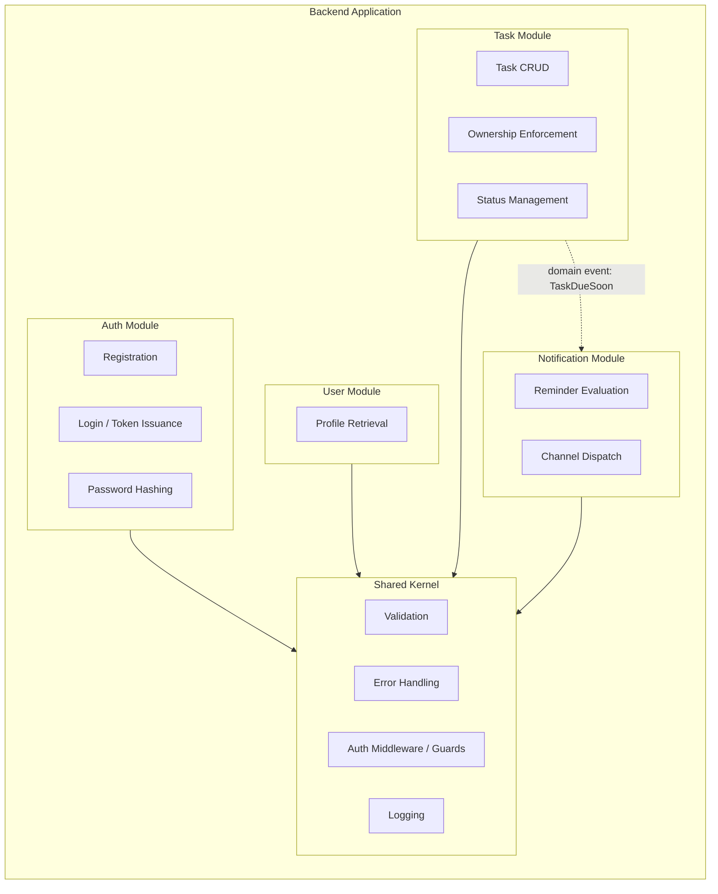
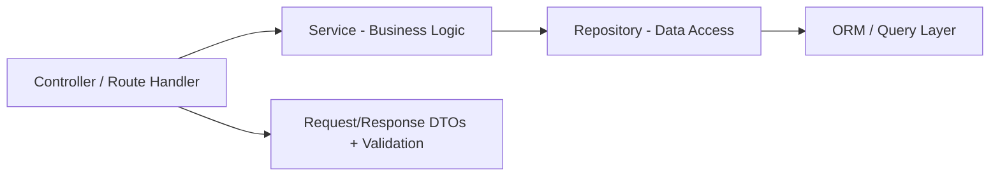

# 2. Solution Architecture

## 2.1 Architecture Style

**Modular Monolith**, deployed as a single stateless backend service composed of independently developed, loosely-coupled modules — each following the Single Responsibility Principle and depending only on the interfaces (not implementations) of other modules.

This is chosen over microservices because:

- The MVP has a single bounded context (personal task management), per BRD Section 3.2 (no collaboration, no teams).
- Microservices would introduce distributed-transaction, service-discovery, and network-latency concerns disproportionate to the current scope.
- Module boundaries are drawn along the same seams a future microservice split would use (Auth, Task, Notification), so extraction later is a refactor, not a rewrite — satisfying the "scalable foundation" business objective (Section 2).

## 2.2 Module Breakdown

| Module | Responsibility | Key Requirements |
|---|---|---|
| Auth Module | Registration, login, logout, password hashing, token issuance/validation | FR-01–FR-03, NFR-01, BR-06 |
| User Module | Authenticated user profile access | Supports FR-11 |
| Task Module | Task CRUD, status transitions, ownership enforcement | FR-04–FR-09, FR-11, FR-12, BR-01–BR-03, BR-05, BR-07 |
| Notification Module | Due-date evaluation, reminder dispatch across channels | FR-10, BR-04, UC-06 |
| Shared Kernel | Cross-cutting validation, error mapping, auth guards, logging | NFR-02, NFR-03, NFR-08 |

## 2.3 Layering Within Each Module

Each module follows a consistent internal layering to keep concerns separated and testable:

- **Controller**: parses/validates HTTP input, delegates to service, maps result to HTTP response. No business logic.
- **Service**: encapsulates business rules (e.g., ownership checks, status transition rules). Framework-agnostic where possible, to keep it unit-testable.
- **Repository**: sole owner of persistence access for its module's entities; other modules never query another module's tables directly.
- **DTOs**: strongly typed request/response contracts; validated before reaching the service layer (NFR-03).

## 2.4 Cross-Module Communication

- Synchronous, in-process calls between modules are made through **service interfaces only** (no reaching into another module's repository or ORM entities).
- The Task → Notification interaction is modeled as a **domain event** (`TaskDueSoon`, `TaskCreated`, `TaskCompleted`) rather than a direct call, so the Notification module can evolve independently and so this seam is ready to become an asynchronous message (e.g., queue) if extracted into a separate service.

## 2.5 Evolution Path (Post-MVP)

| Future Need | Extension Point |
|---|---|
| Task sharing / collaboration (out of scope now) | Add a Sharing module; Task module already isolates ownership logic behind `TaskOwnershipPolicy`. |
| Mobile app | Existing REST API is channel-agnostic; no web-specific coupling. |
| Third-party integrations (calendar, Slack) | Notification module's channel dispatch is already pluggable (see [Integration Architecture](13-integration-architecture.md)). |
| Extraction to microservices | Module boundaries and domain events double as future service boundaries and message contracts. |

## 2.6 Non-Goals

- No multi-tenancy beyond per-user data isolation (BR-05).
- No RBAC — single `User` role only (BRD Section 4).
- No offline-first/PWA support (BRD Section 3.2).
