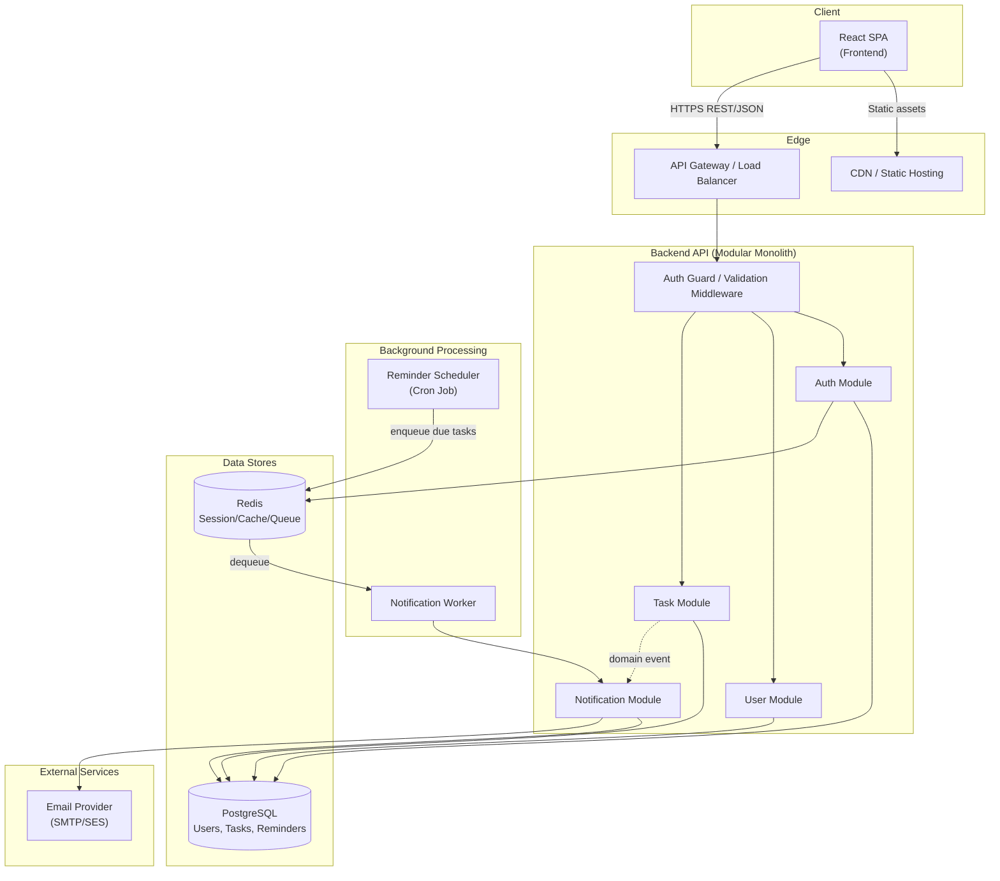

# 3. Component Diagram

## 3.1 Overview

This diagram shows the runtime components of the system and how they collaborate, independent of physical deployment (see [Deployment Diagram](04-deployment-diagram.md) for infrastructure placement).

## 3.2 Component Responsibilities

| Component | Type | Responsibility |
|---|---|---|
| React SPA | Frontend | Renders UI, manages client-side state, calls backend REST API |
| CDN / Static Hosting | Infrastructure | Serves frontend static assets (JS/CSS/HTML) with low latency |
| API Gateway / Load Balancer | Infrastructure | TLS termination, routing, rate limiting, distributes traffic across backend instances |
| Auth Guard / Validation Middleware | Backend (shared) | Verifies JWT, extracts user identity, validates request payloads before reaching modules |
| Auth Module | Backend | Registration, login, logout, token issuance |
| User Module | Backend | Authenticated user profile access |
| Task Module | Backend | Task CRUD, ownership enforcement, status transitions |
| Notification Module | Backend | Reminder evaluation and dispatch across channels |
| Reminder Scheduler | Background job | Periodically scans tasks nearing/at due date, enqueues reminder work |
| Notification Worker | Background job | Consumes queued reminder jobs, invokes Notification Module |
| PostgreSQL | Data store | Durable storage for users, tasks, reminders |
| Redis | Data store | Session/token cache and lightweight job queue |
| Email Provider | External | Delivers reminder emails |

## 3.3 Interface Contracts

| Interface | Consumer → Provider | Protocol |
|---|---|---|
| Public API | SPA → API Gateway | HTTPS / JSON (REST) |
| Internal service calls | Controller → Service | In-process function calls |
| Data access | Service → Repository → DB | SQL via ORM |
| Reminder dispatch | Scheduler → Queue → Worker | Redis-backed queue |
| Email delivery | Notification Module → Email Provider | SMTP or provider HTTP API |

Related: [Sequence Diagrams](05-sequence-diagrams.md) show these components interacting over time; [Database Design](12-database-design.md) details the schema behind the data stores.
