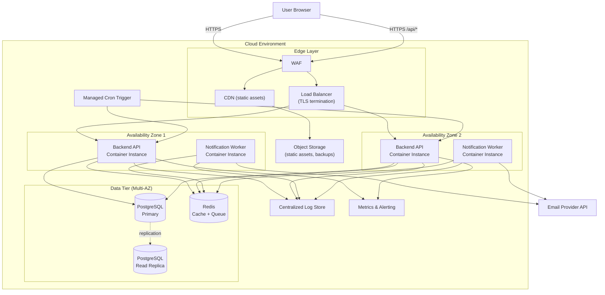
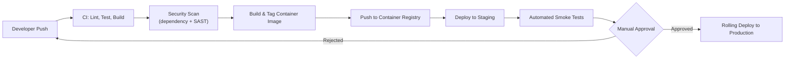

# 4. Deployment Diagram

## 4.1 Overview

The application is deployed as containerized services on a managed cloud platform (illustrated generically; the same topology maps to AWS, Azure, or GCP equivalents — see [Technology Stack](07-technology-stack.md)). The design targets **NFR-05 (99% uptime)** and **NFR-04 (2s load under 1,000 tasks/user)**.

## 4.2 Deployment Topology

## 4.3 Node Descriptions

| Node | Description |
|---|---|
| WAF | Filters malicious traffic (SQLi/XSS patterns) before it reaches the application (NFR-03). |
| CDN | Serves the built frontend SPA bundle with edge caching. |
| Load Balancer | Terminates TLS, health-checks backend instances, distributes traffic across AZs. |
| Backend API instances | Stateless containers running the modular monolith; horizontally scaled behind the load balancer. |
| Notification Worker instances | Separate container process (same codebase, different entrypoint) consuming the reminder queue — scaled independently from the request-serving API. |
| PostgreSQL Primary/Replica | Managed relational database with multi-AZ failover and a read replica for reporting/read-heavy queries. |
| Redis | Managed in-memory store used for token/session caching and as the reminder job queue. |
| Object Storage | Hosts static frontend assets and database backups. |
| Managed Cron Trigger | Invokes the reminder-scan endpoint/job on a fixed schedule (e.g., every 5 minutes). |
| Log Sink / Metrics Sink | Centralized observability backends — see [Logging & Monitoring](10-logging-monitoring.md). |

## 4.4 Environments

| Environment | Purpose | Notes |
|---|---|---|
| Development | Local/dev cloud sandbox | Single instance, no HA, seeded test data |
| Staging | Pre-production validation | Mirrors production topology at reduced scale |
| Production | Live traffic | Multi-AZ, autoscaled, full monitoring |

## 4.5 CI/CD Pipeline

All deployments are rolling (zero-downtime), with automated rollback if health checks fail post-deploy — supporting NFR-05.
