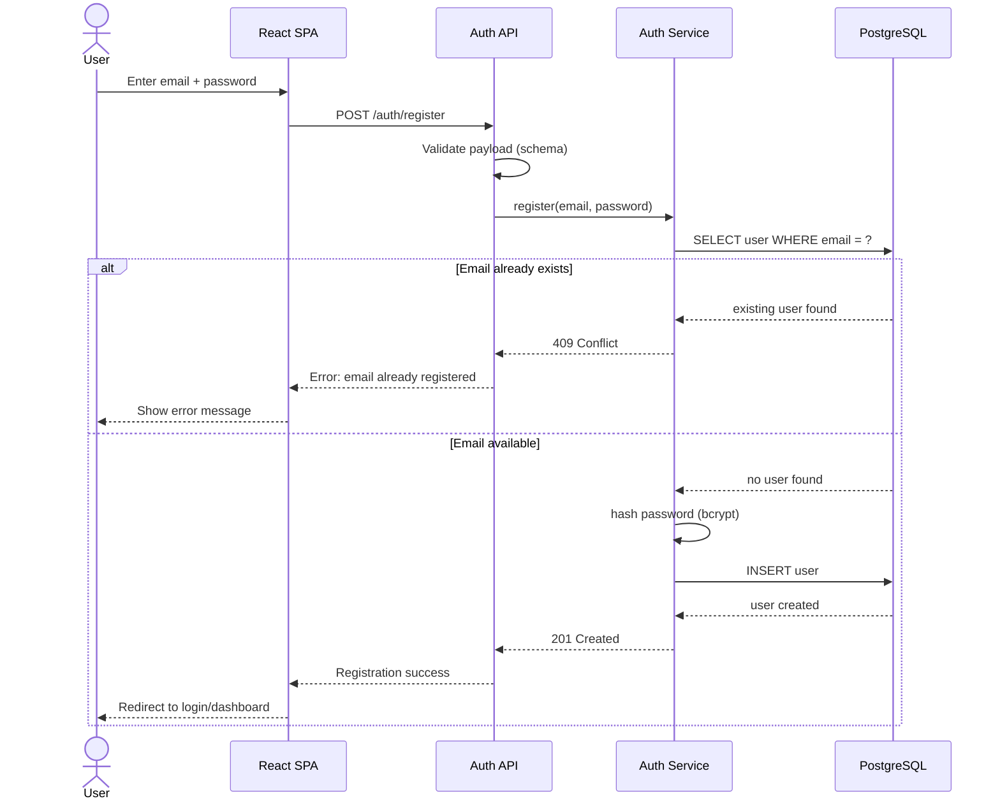
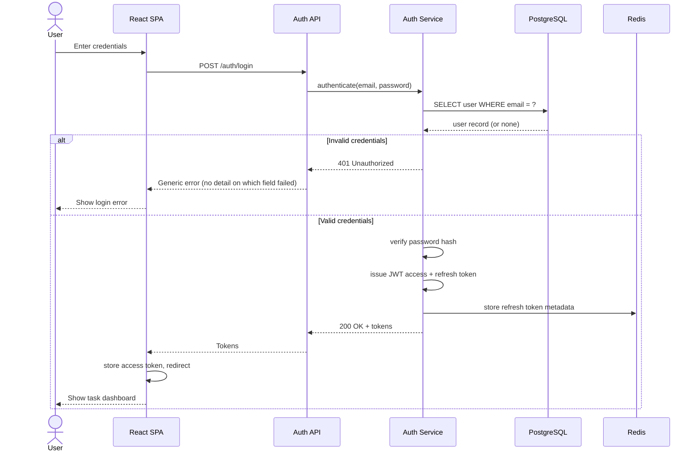
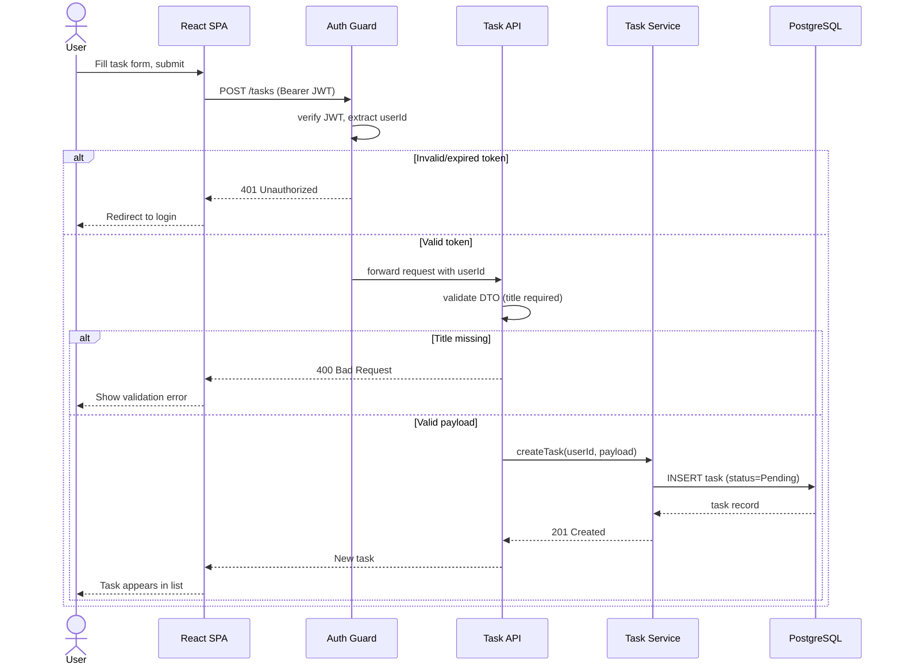
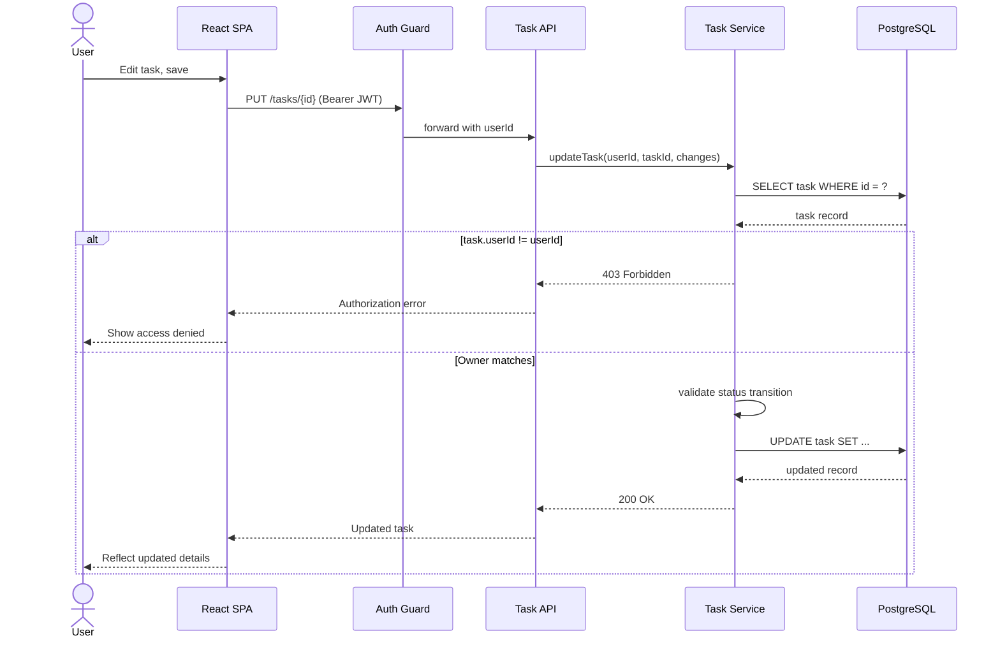
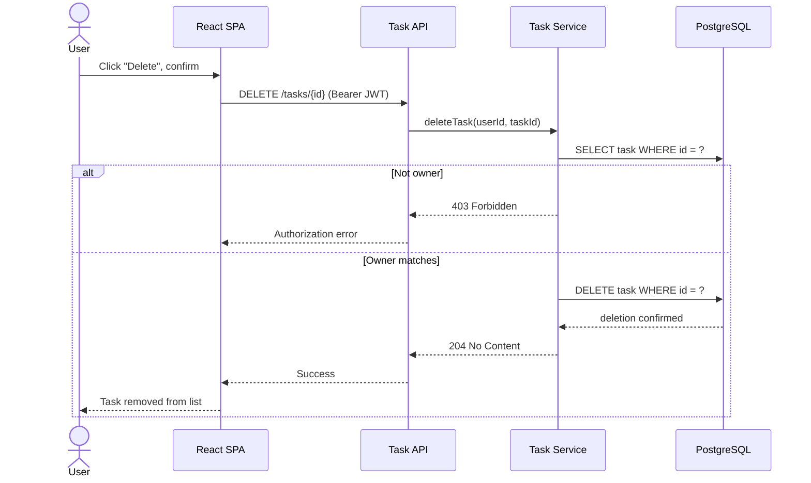
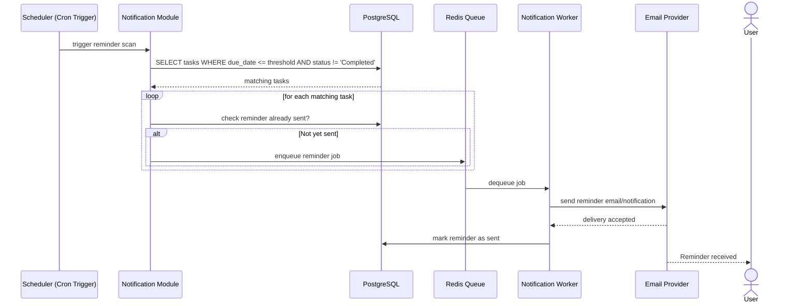

# 5. Sequence Diagrams

This document details the runtime behavior of the key use cases defined in BRD Section 11.

## 5.1 Registration (UC-01)

## 5.2 Login (UC-02)

## 5.3 Create Task (UC-03)

## 5.4 Update Task with Ownership Check (UC-04)

## 5.5 Delete Task (UC-05)

## 5.6 Due-Date Reminder (UC-06)

Related: [Data Flow](06-data-flow.md) shows these same interactions from a data-movement perspective.
