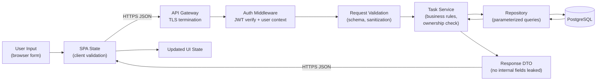
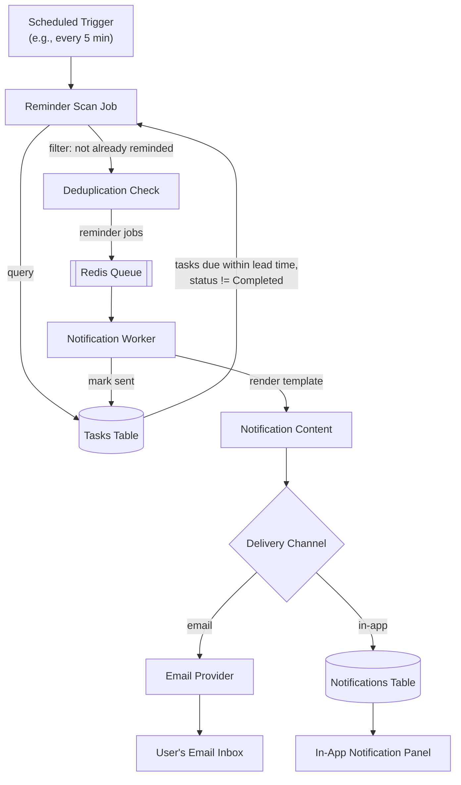

# 6. Data Flow

## 6.1 Request/Response Data Flow (Task CRUD)

Every hop enforces a specific concern relevant to the NFRs:

| Stage | Concern Enforced |
|---|---|
| Client validation | Fast feedback (usability), not trusted as the sole gate |
| TLS termination | Encryption in transit (NFR-01) |
| Auth middleware | Authentication before any business logic runs (NFR-02) |
| Request validation | Sanitization against XSS/SQLi (NFR-03) |
| Ownership check in service | Authorization — user can only touch their own tasks (FR-11, BR-05) |
| Parameterized queries | SQL injection prevention (NFR-03) |
| Response DTO mapping | Prevents leaking internal fields/stack traces (API Security standards) |

## 6.2 Reminder Data Flow

This flow implements **BR-04** (reminders only for non-completed tasks with a due date) and **UC-06**, while keeping the delivery channel pluggable to resolve **BRD Open Question #2** without blocking implementation.

## 6.3 Data Classification

| Data | Classification | Handling |
|---|---|---|
| Password | Highly sensitive | Never stored/logged in plaintext; bcrypt/argon2 hash only |
| Email address | PII | Stored, used for login + reminders; excluded from application logs (NFR-08) |
| Task title/description | User content | Owned exclusively by the creating user; not shared |
| JWT / refresh tokens | Sensitive credential | Transmitted over HTTPS only; refresh tokens stored hashed |
| Audit/action logs | Operational | Contains action + user ID, not task content or credentials |

## 6.4 Data Retention

Per BRD Section 15 (Open Questions) and BR-07, the default behavior — pending stakeholder confirmation — is:

- Deleted tasks are **soft-deleted** (flagged `deleted_at`) for a configurable retention window, then purged, satisfying both "permanent removal" and potential undo/audit needs without conflicting with BR-07's requirement that completed tasks remain visible until explicitly deleted.
- See [Database Design §12.4](12-database-design.md#124-soft-delete-strategy) for the schema implementation.
