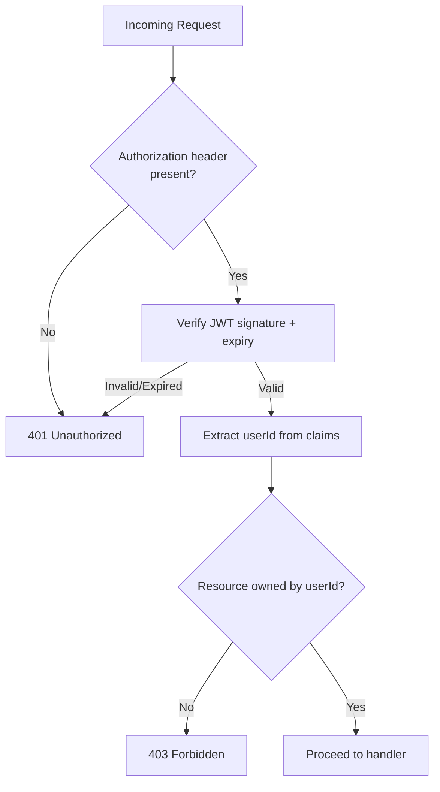

# 8. Security Architecture

## 8.1 Objectives

Directly implements the organization's Security Standards ([CLAUDE.md](../../CLAUDE.md)) and BRD **NFR-01 to NFR-03**.

## 8.2 Authentication & Authorization Flow

| Layer | Mechanism |
|---|---|
| Authentication | Email + password, verified against a bcrypt/argon2 hash — never plaintext (NFR-01) |
| Session | Short-lived JWT access token + longer-lived refresh token; refresh tokens stored hashed server-side and revocable |
| Authorization | Every task-scoped endpoint checks `task.userId === requestingUserId` before permitting read/write (FR-11, BR-05) |
| Transport | HTTPS enforced everywhere; HSTS enabled (BRD Assumption: "accessed over HTTPS in all environments") |

## 8.3 Secrets Management

- No credentials, API keys, tokens, or connection strings are committed to source control.
- All secrets (DB credentials, JWT signing keys, email provider API keys) are injected at runtime via a managed secrets manager or environment variables, never hardcoded.
- JWT signing keys are rotated on a defined schedule; rotation invalidates only tokens signed with the retired key.

## 8.4 Input Validation & Injection Prevention

| Threat | Mitigation |
|---|---|
| SQL Injection | ORM (Prisma) with parameterized queries exclusively; no raw string-concatenated SQL |
| XSS | React's default output encoding; strict Content-Security-Policy headers; server-side sanitization of any rendered user content |
| CSRF | Not applicable to token-based (Bearer JWT) APIs consumed by a SPA without cookies; if cookies are used for refresh tokens, `SameSite=Strict` + CSRF tokens are applied |
| Mass assignment | DTOs whitelist only expected fields per endpoint; ORM entities never bound directly to request bodies |
| Injection via task fields | All task fields (title, description) validated for length/type; rendered as text, never as HTML/markup |

## 8.5 API Security Practices

| Practice | Implementation |
|---|---|
| Status codes | Correct, specific HTTP codes returned (400, 401, 403, 404, 409, 422, 500) — see [API Design](11-api-design.md) |
| No internal leakage | Error responses return a generic message + error code; stack traces never returned to clients |
| Rate limiting | Login/register endpoints rate-limited per IP/account to mitigate brute force |
| Generic auth errors | Login failure does not reveal whether the email or password was incorrect (UC-02 alternate flow) |

## 8.6 Data Protection

| Data | At Rest | In Transit |
|---|---|---|
| Passwords | Hashed (bcrypt/argon2), never encrypted-and-reversible | Sent only over HTTPS during login/register |
| Database | Encrypted at rest (managed DB encryption) | TLS between app and DB |
| Backups | Encrypted at rest | Encrypted in transfer |
| Tokens | Refresh tokens stored hashed | Bearer tokens sent only over HTTPS |

## 8.7 Security in the SDLC

| Stage | Control |
|---|---|
| Development | Static analysis / linting for common vulnerability patterns |
| CI Pipeline | Dependency vulnerability scanning + SAST on every build (see [Deployment Diagram §4.5](04-deployment-diagram.md#45-cicd-pipeline)) |
| Code Review | Security checklist alignment with [CLAUDE.md](../../CLAUDE.md) Security Standards before merge |
| Pre-Production | Penetration test / security review before first production release |

## 8.8 Audit Logging

Key security-relevant actions (login success/failure, registration, task creation/update/deletion) are logged with user ID, action, timestamp, and outcome — **excluding** password values, tokens, and task content, per **NFR-08**. See [Logging & Monitoring](10-logging-monitoring.md).

## 8.9 Requirements Traceability

| Control | Satisfies |
|---|---|
| Password hashing | NFR-01 |
| Auth guard on all task endpoints | NFR-02, FR-11, BR-05 |
| Input validation/sanitization | NFR-03 |
| No plaintext secrets | CLAUDE.md Security Standards |
