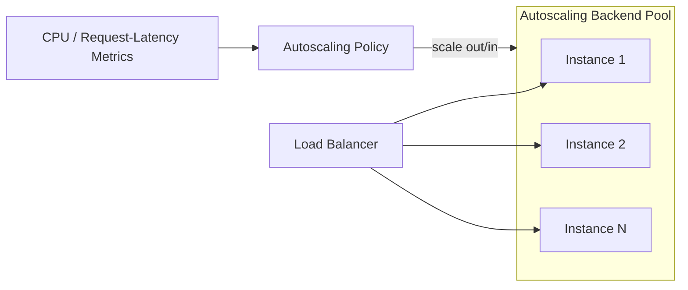
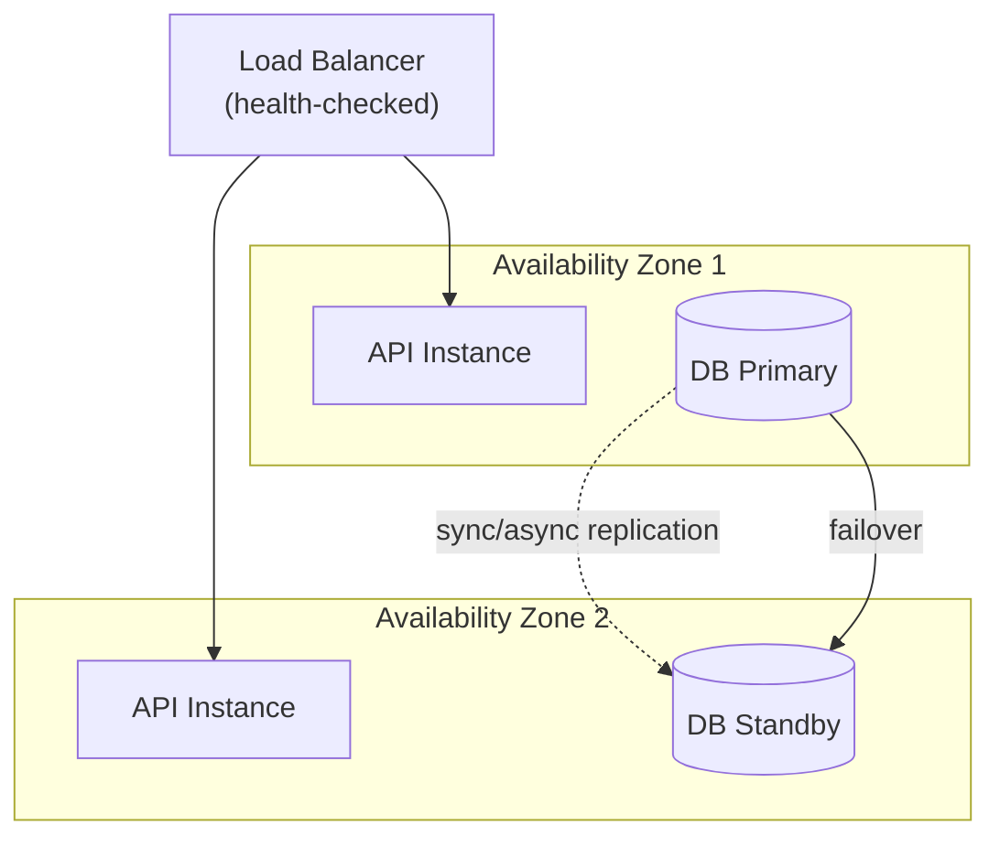

# 9. Scaling & High Availability Strategy

## 9.1 Objectives

Satisfy **NFR-04** (task list loads within 2s for up to 1,000 tasks/user) and **NFR-05** (99% uptime target).

## 9.2 Horizontal Scaling

- Backend API instances are **stateless** — no in-memory session state — so any instance can serve any request, and instances can be added/removed freely (JWT auth, [Security Architecture](08-security-architecture.md)).
- Autoscaling triggers on CPU utilization and p95 request latency thresholds.
- The Notification Worker scales independently from the API pool, since reminder-processing load is unrelated to interactive request volume.

## 9.3 Database Scaling

| Technique | Purpose |
|---|---|
| Read replica | Offloads read-heavy queries (e.g., task list views) from the primary, supporting NFR-04 at higher user counts |
| Indexing | Composite index on `(user_id, status)` and `(user_id, due_date)` to keep list/reminder queries fast as task counts grow toward 1,000/user (see [Database Design](12-database-design.md)) |
| Connection pooling | PgBouncer (or platform-managed pooling) prevents connection exhaustion as instance count scales |
| Pagination | Task list endpoint paginates rather than returning unbounded result sets |

## 9.4 Caching Strategy

| Cached Data | Store | TTL / Invalidation |
|---|---|---|
| Active session/refresh-token metadata | Redis | Expires with token lifetime |
| Frequently read, rarely changed reference data (e.g., valid status enum) | In-memory / Redis | Static, invalidated on deploy |

Task data itself is not cached by default (correctness > marginal latency gain at this scale); caching can be introduced later if profiling shows it's warranted.

## 9.5 High Availability

| Failure Mode | Mitigation |
|---|---|
| Single API instance crash | Load balancer health checks route traffic away; orchestrator restarts the instance automatically |
| Availability Zone outage | Instances and database span ≥2 AZs; automated DB failover to standby |
| Deployment introduces a regression | Rolling deployment with automated health-check rollback (see [Deployment Diagram §4.5](04-deployment-diagram.md#45-cicd-pipeline)) |
| Reminder job failure | Queue-based processing with retry + dead-letter queue; a failed reminder is retried, not silently dropped |
| Downstream email provider outage | Notification Worker retries with backoff; reminder remains queued rather than lost |

## 9.6 Graceful Degradation

- If the email provider is unavailable, in-app notifications still record the reminder so the user is not silently missed (addresses BRD risk: "reminder delivery channel unclear").
- If Redis is temporarily unavailable, authentication falls back to stateless JWT verification alone (refresh-token revocation checks degrade gracefully rather than causing a full outage).

## 9.7 Capacity Planning Baseline

| Metric | Target |
|---|---|
| Task list response time | < 2s at 1,000 tasks/user (NFR-04) |
| Uptime | 99% monthly (NFR-05) |
| Reminder evaluation lag | < 5 minutes from scheduled scan interval |

Future growth (e.g., collaboration features) will be re-evaluated against these baselines before the modular monolith is split into independently scaled services (see [Solution Architecture §2.5](02-solution-architecture.md#25-evolution-path-post-mvp)).
