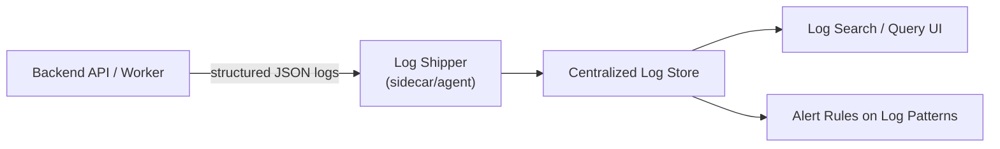
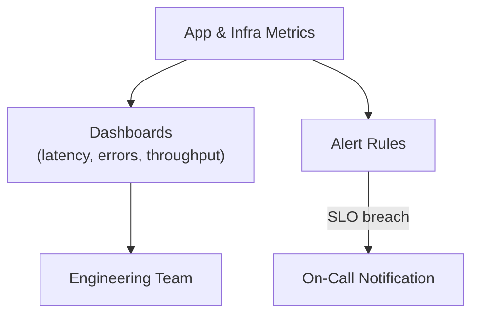

# 10. Logging & Monitoring

## 10.1 Objectives

Implements **NFR-08** (auditability of key actions without logging sensitive personal data) and provides the operational visibility needed to sustain **NFR-05** (99% uptime).

## 10.2 Logging Strategy

| Log Type | Content | Excludes |
|---|---|---|
| Access logs | Method, path, status code, latency, correlation ID | Request/response bodies |
| Audit logs | User ID, action (task created/updated/deleted, login success/failure), timestamp, outcome | Task content, passwords, tokens |
| Error logs | Error code, message, correlation ID, stack trace (server-side only) | Never returned to the client (Security Standards) |

- Every request is tagged with a **correlation ID** (generated at the edge, propagated through all internal calls) to allow tracing a single user action across modules and the reminder pipeline.
- Logs are structured JSON (not free-text) for reliable querying and alerting.
- Sensitive fields (email, password, tokens) are never logged in plaintext; email may be logged as a hashed/partially-masked identifier if needed for support.

## 10.3 Monitoring & Metrics

| Metric Category | Examples | Purpose |
|---|---|---|
| Golden signals | Request rate, error rate, p50/p95/p99 latency, saturation | Detect degradation before it breaches NFR-04/NFR-05 |
| Business metrics | Registrations/day, tasks created/day, reminders sent vs. failed | Product health visibility |
| Infrastructure | CPU/memory per instance, DB connections, queue depth | Capacity planning, scaling triggers ([Scaling Strategy](09-scaling-ha-strategy.md)) |
| Reminder pipeline | Queue lag, job failure rate, email delivery success rate | Ensures FR-10/UC-06 SLAs are met |

## 10.4 Alerting Thresholds (Baseline)

| Condition | Severity | Action |
|---|---|---|
| Error rate > 5% over 5 minutes | Critical | Page on-call |
| p95 latency > 2s sustained 5 minutes | Warning | Investigate, correlates with NFR-04 |
| Reminder queue lag > 15 minutes | Warning | Investigate worker/queue health |
| Database connection pool > 90% utilized | Warning | Check for connection leaks / scale DB |
| Uptime check failure (health endpoint) | Critical | Page on-call, triggers failover per [HA Strategy](09-scaling-ha-strategy.md) |

## 10.5 Health Checks

- Each backend instance exposes a `/health` endpoint checked by the load balancer (liveness) and a `/ready` endpoint verifying DB/Redis connectivity (readiness) before receiving traffic.
- The Notification Worker exposes an equivalent liveness signal monitored by the orchestrator.

## 10.6 Retention

| Data | Retention |
|---|---|
| Access/error logs | 30–90 days (adjustable per compliance need) |
| Audit logs | Longer retention (e.g., 1 year) to support troubleshooting and accountability, without containing sensitive content |
| Metrics | Standard retention per monitoring platform (e.g., 15 months at reduced resolution) |
