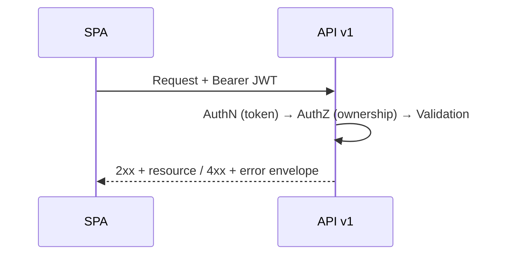

# 11. API Design & Communication

## 11.1 Style

RESTful JSON API over HTTPS. Versioned under `/api/v1` to allow non-breaking evolution as new features (e.g., collaboration) are added post-MVP.

## 11.2 Endpoint Summary

| Method | Path | Description | Requirement |
|---|---|---|---|
| POST | `/api/v1/auth/register` | Create a new account | FR-01, UC-01 |
| POST | `/api/v1/auth/login` | Authenticate and issue tokens | FR-02, UC-02 |
| POST | `/api/v1/auth/logout` | Invalidate refresh token | FR-03 |
| POST | `/api/v1/auth/refresh` | Exchange refresh token for new access token | Supports stateless session model |
| GET | `/api/v1/users/me` | Get authenticated user's profile | Supports FR-11 |
| GET | `/api/v1/tasks` | List authenticated user's tasks (paginated, filterable by status) | FR-05, FR-11 |
| POST | `/api/v1/tasks` | Create a task | FR-04, UC-03 |
| GET | `/api/v1/tasks/{id}` | Get a single task's details | FR-06 |
| PUT | `/api/v1/tasks/{id}` | Update a task | FR-07, UC-04 |
| PATCH | `/api/v1/tasks/{id}/status` | Update only a task's status | FR-09 |
| DELETE | `/api/v1/tasks/{id}` | Delete a task | FR-08, UC-05 |

## 11.3 Request/Response Contract

### Create Task — Request

```json
{
  "title": "Finish architecture doc",
  "description": "Draft HLD and diagrams",
  "dueDate": "2026-08-15T17:00:00Z",
  "priority": "High"
}
```

### Create Task — Response (201 Created)

```json
{
  "id": "b6a1e6b0-3f2e-4c7a-9c2a-1e2f3a4b5c6d",
  "title": "Finish architecture doc",
  "description": "Draft HLD and diagrams",
  "dueDate": "2026-08-15T17:00:00Z",
  "priority": "High",
  "status": "Pending",
  "createdAt": "2026-08-10T09:00:00Z",
  "updatedAt": "2026-08-10T09:00:00Z"
}
```

Response objects never include internal fields (`userId` foreign key, soft-delete markers, password hashes on user objects) — only what the client needs (API Security Standards).

## 11.4 Standard Error Format

```json
{
  "error": {
    "code": "VALIDATION_ERROR",
    "message": "Title is required.",
    "correlationId": "3f9a2b1c-..."
  }
}
```

No stack traces or internal implementation details are ever included in error responses.

## 11.5 HTTP Status Code Usage

| Code | Meaning | Example |
|---|---|---|
| 200 | Success | GET/PUT succeeded |
| 201 | Created | Task/account created |
| 204 | No Content | Delete succeeded |
| 400 | Bad Request | Validation failure (e.g., missing title) |
| 401 | Unauthorized | Missing/invalid/expired token |
| 403 | Forbidden | Authenticated but not the resource owner (FR-11, BR-05) |
| 404 | Not Found | Task/resource does not exist |
| 409 | Conflict | Duplicate email on registration (BR-06) |
| 422 | Unprocessable Entity | Semantically invalid state transition |
| 429 | Too Many Requests | Rate limit exceeded (login/register abuse protection) |
| 500 | Internal Server Error | Unexpected failure — logged, generic message returned |

## 11.6 Communication Sequence Overview



## 11.7 Pagination & Filtering

`GET /api/v1/tasks` supports:

| Query Param | Purpose |
|---|---|
| `status` | Filter by `Pending`, `In Progress`, `Completed` (BR-03, BR-07) |
| `page`, `pageSize` | Pagination to keep responses fast as task count grows toward 1,000/user (NFR-04) |
| `sortBy`, `sortDir` | Sorting by due date/priority/created date |

## 11.8 API Documentation

The API is documented via an OpenAPI (Swagger) specification generated from backend decorators/annotations, kept in sync with the implementation and published for frontend/consumer reference.
