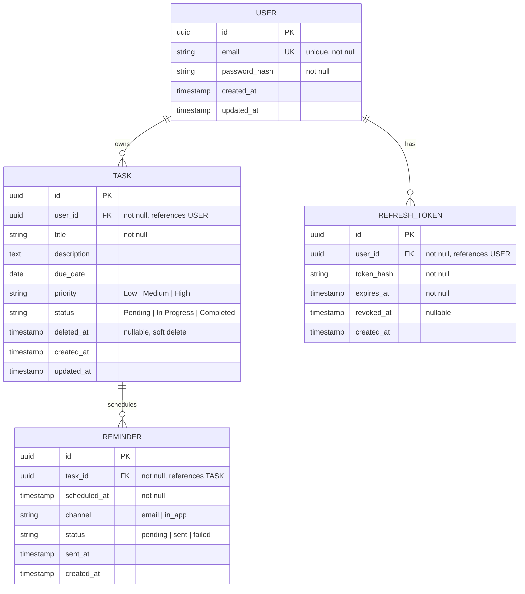

# 12. Database Design

## 12.1 Entity-Relationship Diagram

## 12.2 Table Definitions

### `users`

| Column | Type | Constraints | Notes |
|---|---|---|---|
| id | UUID | PK | |
| email | VARCHAR(255) | UNIQUE, NOT NULL | Enforces BR-06 at the database level, not just application logic |
| password_hash | VARCHAR(255) | NOT NULL | bcrypt/argon2 hash only (NFR-01) |
| created_at | TIMESTAMPTZ | NOT NULL DEFAULT now() | |
| updated_at | TIMESTAMPTZ | NOT NULL DEFAULT now() | |

### `tasks`

| Column | Type | Constraints | Notes |
|---|---|---|---|
| id | UUID | PK | |
| user_id | UUID | FK → users(id), NOT NULL | Enforces BR-01 (task always belongs to exactly one user) |
| title | VARCHAR(255) | NOT NULL, length > 0 | Enforces BR-02 |
| description | TEXT | NULLABLE | |
| due_date | DATE / TIMESTAMPTZ | NULLABLE | Drives reminder scheduling (FR-10) |
| priority | ENUM(`Low`,`Medium`,`High`) | NOT NULL DEFAULT `Medium` | |
| status | ENUM(`Pending`,`In Progress`,`Completed`) | NOT NULL DEFAULT `Pending` | Enforces BR-03 |
| deleted_at | TIMESTAMPTZ | NULLABLE | Soft-delete marker; see §12.4 |
| created_at | TIMESTAMPTZ | NOT NULL DEFAULT now() | |
| updated_at | TIMESTAMPTZ | NOT NULL DEFAULT now() | |

### `reminders`

| Column | Type | Constraints | Notes |
|---|---|---|---|
| id | UUID | PK | |
| task_id | UUID | FK → tasks(id), NOT NULL | |
| scheduled_at | TIMESTAMPTZ | NOT NULL | When the reminder should fire, per configured lead time |
| channel | ENUM(`email`,`in_app`) | NOT NULL | Pluggable per [Integration Architecture](13-integration-architecture.md) |
| status | ENUM(`pending`,`sent`,`failed`) | NOT NULL DEFAULT `pending` | |
| sent_at | TIMESTAMPTZ | NULLABLE | |
| created_at | TIMESTAMPTZ | NOT NULL DEFAULT now() | |

### `refresh_tokens`

| Column | Type | Constraints | Notes |
|---|---|---|---|
| id | UUID | PK | |
| user_id | UUID | FK → users(id), NOT NULL | |
| token_hash | VARCHAR(255) | NOT NULL | Never stores the raw token |
| expires_at | TIMESTAMPTZ | NOT NULL | |
| revoked_at | TIMESTAMPTZ | NULLABLE | Set on logout (FR-03) |
| created_at | TIMESTAMPTZ | NOT NULL DEFAULT now() | |

## 12.3 Indexing Strategy

| Table | Index | Purpose |
|---|---|---|
| users | UNIQUE(email) | Enforces BR-06, fast login lookup |
| tasks | (user_id, status) | Fast filtered task-list queries (FR-05, NFR-04) |
| tasks | (user_id, due_date) | Fast reminder-scan queries (FR-10) |
| tasks | (user_id) WHERE deleted_at IS NULL | Partial index to keep active-task queries fast as soft-deleted rows accumulate |
| reminders | (scheduled_at, status) | Fast scan for due, unsent reminders |
| refresh_tokens | (user_id) | Fast lookup/revocation on logout |

## 12.4 Soft-Delete Strategy

Per BR-07 (completed tasks remain visible until explicitly deleted) and BRD Open Question #3, tasks use a `deleted_at` marker rather than immediate hard deletion:

- `DELETE /tasks/{id}` sets `deleted_at = now()` rather than removing the row immediately.
- All read queries (list, get, reminder scan) filter `WHERE deleted_at IS NULL` by default.
- A scheduled purge job permanently removes rows past a configurable retention window (e.g., 30 days), satisfying NFR-09 (no orphaned records — reminders are purged via cascading delete first).
- This default should be confirmed against the stakeholder answer to BRD Open Question #3 before final implementation.

## 12.5 Referential Integrity

- `tasks.user_id` and `reminders.task_id` use `ON DELETE CASCADE` at the database level as a safety net, even though the application enforces soft-delete semantics — preventing orphaned records if a hard delete is ever issued directly (NFR-09).
- `refresh_tokens.user_id` cascades on user deletion for the same reason.
