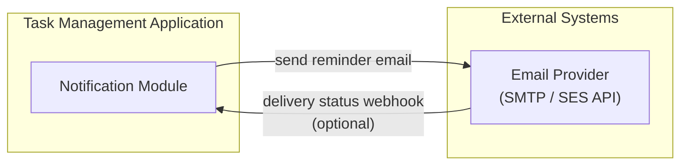
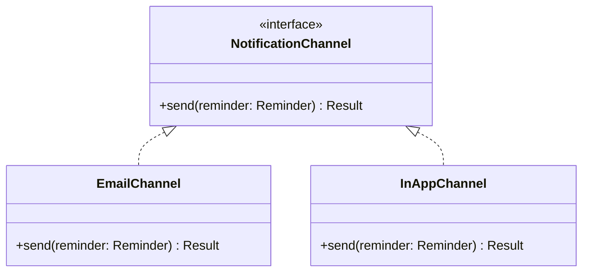

# 13. Integration Architecture

## 13.1 Current Integrations (MVP)

| Integration | Direction | Protocol | Purpose |
|---|---|---|---|
| Email Provider | Outbound | SMTP or provider HTTP API | Deliver due-date reminder emails (FR-10, UC-06) |
| Email Provider (optional) | Inbound | Webhook | Receive delivery/bounce status to mark reminders failed and enable retry |

This is intentionally the **only** external integration in the current release, consistent with BRD Section 3.2 (no calendar sync, Slack, or email-import integrations in scope).

## 13.2 Integration Design Principle: Channel Abstraction

The Notification Module defines a `NotificationChannel` interface, with `EmailChannel` as the only implementation today:

This keeps the resolution of **BRD Open Question #2** (email vs. in-app vs. both) a configuration/implementation detail rather than an architectural change — both channels can be enabled simultaneously without modifying the Task or Auth modules.

## 13.3 Future Integration Points (Out of Scope for MVP)

| Candidate Integration | Extension Point | Notes |
|---|---|---|
| Calendar sync (Google/Outlook) | New `NotificationChannel` or a dedicated `CalendarSync` module subscribing to `TaskCreated`/`TaskUpdated` domain events | Explicitly out of scope per BRD Section 3.2 |
| Slack notifications | New `NotificationChannel` implementation | No code change needed in Task module |
| Email-based task import | New inbound adapter feeding the existing `TaskService.createTask()` | Requires parsing/mapping layer only |
| Third-party auth (Google/social login) | Additional `AuthStrategy` alongside the existing email/password strategy | BRD Section 3.2 defers this |
| Mobile app | Consumes the same versioned REST API | No backend change required; API is already channel-agnostic |

## 13.4 Integration Governance

- All outbound integrations authenticate via credentials stored in the secrets manager, never hardcoded (Security Standards, [Security Architecture](08-security-architecture.md)).
- Any new external integration must go through the same validation/sanitization boundary as user input before touching domain logic.
- New integrations are added as new modules or channel implementations — never by injecting logic into the Auth or Task modules — preserving the Single Responsibility boundaries defined in [Solution Architecture](02-solution-architecture.md).
