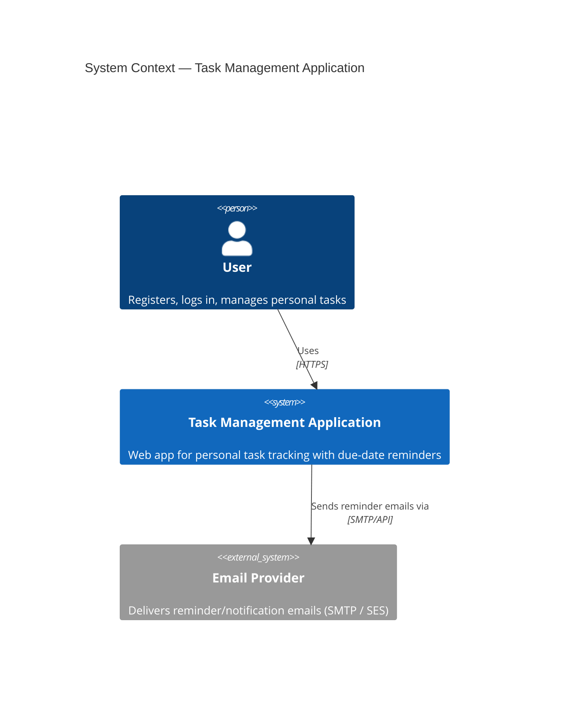

# Task Management Application — Architecture Documentation

This directory contains the complete solution architecture for the **Task Management Application**, derived from the [Business Requirement Document & Software Requirement Specification](../requirements/task-management-app-brd-srs.md). It is intended for engineering teams designing, building, and operating the system.

All diagrams in this documentation set are authored in [Mermaid](https://mermaid.js.org/) and render natively in GitHub, GitLab, and most Markdown viewers.

---

## 1. Document Index

| # | Document | Purpose |
|---|---|---|
| 1 | [High-Level Design](01-high-level-design.md) | System overview, architecture goals, logical view |
| 2 | [Solution Architecture](02-solution-architecture.md) | Architecture style, module boundaries, rationale |
| 3 | [Component Diagram](03-component-diagram.md) | Internal components and their relationships |
| 4 | [Deployment Diagram](04-deployment-diagram.md) | Runtime/infrastructure topology |
| 5 | [Sequence Diagrams](05-sequence-diagrams.md) | Key interaction flows (auth, task CRUD, reminders) |
| 6 | [Data Flow](06-data-flow.md) | Data movement across the system |
| 7 | [Technology Stack](07-technology-stack.md) | Chosen technologies and rationale |
| 8 | [Security Architecture](08-security-architecture.md) | AuthN/AuthZ, data protection, OWASP mitigations |
| 9 | [Scaling & High Availability Strategy](09-scaling-ha-strategy.md) | Horizontal scaling, resilience, failover |
| 10 | [Logging & Monitoring](10-logging-monitoring.md) | Observability strategy |
| 11 | [API Design & Communication](11-api-design.md) | REST contract, versioning, error model |
| 12 | [Database Design](12-database-design.md) | ER model, schema, indexing |
| 13 | [Integration Architecture](13-integration-architecture.md) | External systems and future integration points |

---

## 2. System Context

---

## 3. Architecture Principles

| Principle | Application |
|---|---|
| Single Responsibility & SOLID | Backend organized into independent modules (Auth, User, Task, Notification) with clear boundaries. |
| Secure by Default | All endpoints authenticated/authorized; no plaintext secrets; input validated at the boundary. |
| Scalable Foundation | Stateless services, externalized session/queue state, modular monolith that can be decomposed into services later. |
| Observability First | Structured logs, correlation IDs, and metrics from day one (NFR-08). |
| Cost-Conscious MVP | Modular monolith instead of premature microservices; managed cloud services over self-hosted infrastructure. |

---

## 4. How to Read This Documentation

Start with the [High-Level Design](01-high-level-design.md) for the big picture, then the [Solution Architecture](02-solution-architecture.md) for the "why" behind architectural decisions. Use documents 3–6 for structural and behavioral views, 7–13 for cross-cutting and implementation-guiding concerns.
