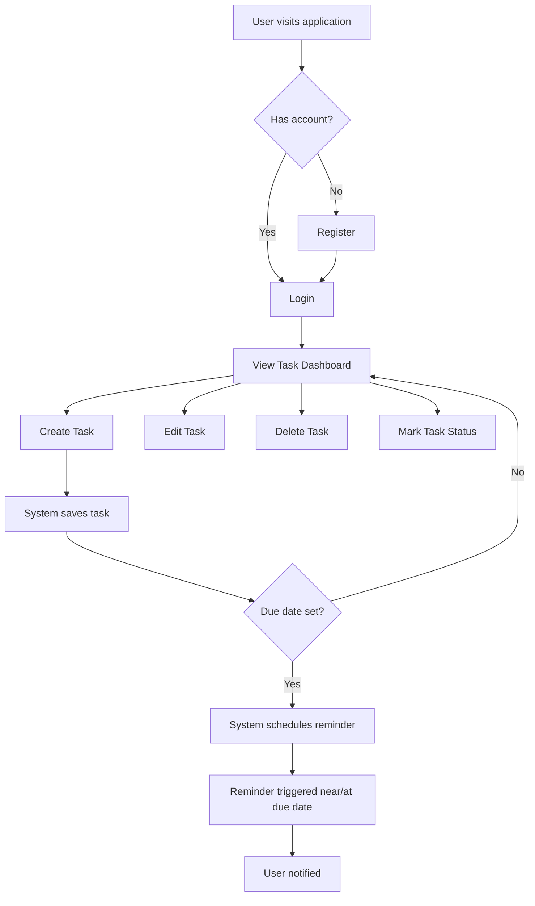

# Task Management Application

## Business Requirement Document (BRD) & Software Requirement Specification (SRS)

| Field | Detail |
|---|---|
| Document Type | BRD + SRS |
| Project | Personal Task Management Application |
| Platform | Web Application |
| Prepared For | Product / Engineering Team |
| Status | Draft v1.0 |

---

## 1. Executive Summary

The organization requires a **web-based Task Management Application** that allows an individual, authenticated user to create, organize, and track their personal tasks. Each user account is independent — there is no task sharing, delegation, or team collaboration in this version. The application focuses on core task CRUD operations, due dates, and reminders to help users stay organized and meet deadlines.

---

## 2. Business Objectives

| Objective | Description |
|---|---|
| Improve personal productivity | Provide users a simple, reliable way to track tasks from creation to completion. |
| Reduce missed deadlines | Notify/remind users of upcoming or overdue tasks. |
| Secure personal data | Ensure each user's tasks are private and accessible only to them via authentication. |
| Provide a scalable foundation | Build the MVP so future features (collaboration, mobile, integrations) can be added without rework. |

---

## 3. Scope

### 3.1 In Scope

- User registration and login (authentication).
- Create, read, update, delete (CRUD) tasks.
- Task due dates and reminder notifications.
- Task status tracking (e.g., Pending, In Progress, Completed).
- Viewing and managing only one's own tasks.

### 3.2 Out of Scope

| Item | Reason |
|---|---|
| Task sharing / assignment to other users | Application is single-user-per-account; no collaboration features in this release. |
| Team/organization workspaces | Not required per current scope. |
| Mobile native app / desktop app | Platform limited to Web Application for this release. |
| Third-party integrations (calendar sync, Slack, email tasks import) | Not requested; candidate for future phase. |
| Offline mode / PWA support | Not requested; candidate for future phase. |
| Role-based access control (Admin/Manager roles) | Not applicable — single user role only. |
| Password recovery via SMS / social login (Google, etc.) | Only standard email/password auth assumed unless confirmed otherwise. |

---

## 4. Actors / User Roles

| Actor | Description |
|---|---|
| **User** | An authenticated individual who registers, logs in, and manages their own personal tasks. |
| **System** | Automated component responsible for triggering due-date reminders/notifications. |

> Note: There is only one functional role (**User**) in this release — no Admin or Manager role is defined.

---

## 5. Assumptions

- Each registered account belongs to exactly one individual; there is no concept of shared accounts.
- Reminders are delivered within the application (in-app notification) and/or via email; exact channel to be confirmed with stakeholders (see Open Questions).
- Users have a valid, unique email address to register.
- The application will be accessed over HTTPS in all environments.
- Time zone for due dates/reminders is based on the user's account/browser settings unless otherwise specified.

---

## 6. Dependencies

| Dependency | Description |
|---|---|
| Authentication mechanism | Requires a secure auth provider/library (e.g., session or token-based auth) before task features can be built. |
| Notification/reminder delivery channel | Requires email service integration and/or in-app notification mechanism. |
| Database | Requires a persistent data store for users and tasks. |
| Backend API | Frontend depends on backend REST/GraphQL API availability for all task and auth operations. |

---

## 7. Constraints

- Application is limited to **Web** platform only for this release.
- No collaboration/multi-user visibility features are to be built.
- Must comply with the organization's Security Standards (no exposed credentials, input validation, protected endpoints — see [CLAUDE.md](../../CLAUDE.md)).

---

## 8. Risks

| Risk | Impact | Likelihood | Mitigation |
|---|---|---|---|
| Reminder delivery channel unclear (email vs in-app) | Medium | Medium | Confirm with stakeholder before backend implementation; default to in-app if unconfirmed. |
| Users may expect basic sorting/filtering not currently in scope | Low | Medium | Document as a fast-follow enhancement; validate with stakeholder. |
| Time zone handling for due dates/reminders may cause confusion | Medium | Medium | Standardize on user's local browser time zone; document behavior clearly to users. |
| Authentication scope not fully defined (password reset, email verification) | Medium | High | Raise as open question (Section 14) before backend design. |

---

## 9. Functional Requirements

| ID | Requirement | Priority |
|---|---|---|
| FR-01 | User shall be able to register a new account using email and password. | High |
| FR-02 | User shall be able to log in using registered credentials. | High |
| FR-03 | User shall be able to log out of the application. | High |
| FR-04 | User shall be able to create a new task with a title, optional description, due date, and priority. | High |
| FR-05 | User shall be able to view a list of all their own tasks. | High |
| FR-06 | User shall be able to view details of a single task. | High |
| FR-07 | User shall be able to update an existing task's details (title, description, due date, priority, status). | High |
| FR-08 | User shall be able to delete a task. | High |
| FR-09 | User shall be able to mark a task's status (e.g., Pending, In Progress, Completed). | High |
| FR-10 | System shall notify/remind the user of tasks approaching or past their due date. | High |
| FR-11 | User shall only be able to view, edit, or delete tasks belonging to their own account. | High |
| FR-12 | System shall persist all task and user data across sessions. | High |

---

## 10. Non-Functional Requirements

| ID | Category | Requirement |
|---|---|---|
| NFR-01 | Security | All passwords must be securely hashed; no credentials stored or transmitted in plain text. |
| NFR-02 | Security | All endpoints handling task data must validate that the requesting user is authenticated and authorized to access the resource. |
| NFR-03 | Security | Application must validate and sanitize all user input to prevent SQL Injection and XSS. |
| NFR-04 | Performance | Task list views should load within 2 seconds under normal load for up to 1,000 tasks per user. |
| NFR-05 | Availability | Application should target 99% uptime for the hosted environment. |
| NFR-06 | Usability | UI must be responsive and usable across common desktop browser viewport sizes. |
| NFR-07 | Maintainability | Codebase must follow SOLID principles, modular architecture, and be covered by automated tests per project engineering standards. |
| NFR-08 | Auditability | System should log key actions (task creation, update, deletion) for troubleshooting, without logging sensitive personal data. |
| NFR-09 | Data Integrity | Deleted tasks should be permanently removed (or soft-deleted per business rule — see Section 12) with no orphaned records. |

---

## 11. Use Cases

### UC-01: Register Account

| Field | Detail |
|---|---|
| Actor | User |
| Precondition | User does not have an existing account. |
| Main Flow | 1. User navigates to registration page. 2. User enters email and password. 3. System validates input. 4. System creates account and redirects to login or dashboard. |
| Alternate Flow | Email already registered → system displays error. |
| Postcondition | New user account created. |

### UC-02: Login

| Field | Detail |
|---|---|
| Actor | User |
| Precondition | User has a registered account. |
| Main Flow | 1. User enters email and password. 2. System validates credentials. 3. System grants access and redirects to task dashboard. |
| Alternate Flow | Invalid credentials → system displays error without revealing whether email or password was incorrect. |
| Postcondition | User is authenticated and session/token is issued. |

### UC-03: Create Task

| Field | Detail |
|---|---|
| Actor | User |
| Precondition | User is authenticated. |
| Main Flow | 1. User selects "Add Task." 2. User enters title, optional description, due date, priority. 3. User submits. 4. System validates and saves the task. |
| Alternate Flow | Required field (title) missing → system displays validation error. |
| Postcondition | New task appears in user's task list. |

### UC-04: Update Task

| Field | Detail |
|---|---|
| Actor | User |
| Precondition | User is authenticated and owns the task. |
| Main Flow | 1. User selects a task. 2. User edits fields (title, description, due date, priority, status). 3. User saves changes. 4. System validates and updates the task. |
| Alternate Flow | User attempts to edit a task they do not own → system returns authorization error (403). |
| Postcondition | Task reflects updated details. |

### UC-05: Delete Task

| Field | Detail |
|---|---|
| Actor | User |
| Precondition | User is authenticated and owns the task. |
| Main Flow | 1. User selects "Delete" on a task. 2. System prompts for confirmation. 3. User confirms. 4. System removes the task. |
| Alternate Flow | User cancels confirmation → no action taken. |
| Postcondition | Task no longer appears in user's task list. |

### UC-06: Receive Due Date Reminder

| Field | Detail |
|---|---|
| Actor | System, User |
| Precondition | Task has a due date and is not yet completed. |
| Main Flow | 1. System evaluates tasks nearing/at/past due date. 2. System triggers a reminder notification to the user. 3. User views the reminder. |
| Alternate Flow | Task already marked Completed → no reminder is sent. |
| Postcondition | User is informed of upcoming/overdue task. |

---

## 12. Business Rules

| ID | Rule |
|---|---|
| BR-01 | A task must always belong to exactly one user; tasks cannot be reassigned to another user. |
| BR-02 | A task must have a non-empty title. |
| BR-03 | A task's status must be one of: `Pending`, `In Progress`, `Completed`. |
| BR-04 | Reminders are only triggered for tasks with a due date that are not in `Completed` status. |
| BR-05 | Only the owning user can view, edit, or delete a given task. |
| BR-06 | A user cannot register two accounts with the same email address. |
| BR-07 | Completed tasks remain visible in the task list (e.g., under a "Completed" filter) unless explicitly deleted by the user. |

---

## 13. Process Flow

---

## 14. User Stories & Acceptance Criteria

### US-01: Account Registration

**As a** new user, **I want to** create an account with my email and password **so that** I can securely access my personal task list.

**Acceptance Criteria:**
- Given valid email and password, when I submit the registration form, then my account is created and I am directed to login or dashboard.
- Given an email already in use, when I submit the registration form, then I see a clear error message and no duplicate account is created.
- Given a password that doesn't meet minimum security requirements, when I submit the form, then I see a validation error.

### US-02: Login

**As a** registered user, **I want to** log in with my credentials **so that** I can access my personal tasks.

**Acceptance Criteria:**
- Given correct credentials, when I submit the login form, then I am authenticated and redirected to my task dashboard.
- Given incorrect credentials, when I submit the login form, then I see an error message and remain on the login page.

### US-03: Create Task

**As a** logged-in user, **I want to** add a new task with a title, description, due date, and priority **so that** I can track what I need to do.

**Acceptance Criteria:**
- Given I provide a valid title, when I save the task, then it appears in my task list with status `Pending`.
- Given I leave the title empty, when I attempt to save, then I see a validation error and the task is not created.
- Given I set a due date, when the task is saved, then the due date is stored and used for reminders.

### US-04: View Task List

**As a** logged-in user, **I want to** view all of my tasks **so that** I can see what needs to be done.

**Acceptance Criteria:**
- Given I have existing tasks, when I open the dashboard, then I see all tasks belonging only to my account.
- Given I have no tasks, when I open the dashboard, then I see an appropriate empty state message.

### US-05: Update Task

**As a** logged-in user, **I want to** edit a task's details **so that** I can keep my task information accurate.

**Acceptance Criteria:**
- Given I own a task, when I update its fields and save, then the updated details are persisted and reflected in the list.
- Given I attempt to edit a task I do not own, when the request is made, then it is rejected with an authorization error.

### US-06: Delete Task

**As a** logged-in user, **I want to** delete a task **so that** I can remove items I no longer need to track.

**Acceptance Criteria:**
- Given I own a task, when I confirm deletion, then the task is permanently removed from my list.
- Given I cancel the deletion confirmation, when I return to the list, then the task is still present.

### US-07: Mark Task Status

**As a** logged-in user, **I want to** update a task's status **so that** I can track my progress.

**Acceptance Criteria:**
- Given a task in `Pending` status, when I change it to `In Progress` or `Completed`, then the new status is saved and displayed.
- Given a task is marked `Completed`, when reminders are evaluated, then no further reminders are sent for that task.

### US-08: Receive Due Date Reminders

**As a** logged-in user, **I want to** be reminded when a task's due date is approaching or has passed **so that** I don't miss deadlines.

**Acceptance Criteria:**
- Given a task has a due date and is not `Completed`, when the due date approaches (per configured lead time), then I receive a reminder notification.
- Given a task is marked `Completed` before its due date, when the due date arrives, then no reminder is sent.

---

## 15. Open Questions (Require Stakeholder Confirmation)

1. What lead time should reminders use (e.g., 1 day before, 1 hour before due date)?
2. Should reminders be delivered via email, in-app notification, or both?
3. Should deleted tasks be permanently removed or soft-deleted (retained for a period, e.g., for undo/audit purposes)?
4. Are password reset and email verification flows required for this release, or deferred?
5. Is there a minimum password complexity policy to enforce?

---

## 16. Approval

| Role | Name | Date |
|---|---|---|
| Business Analyst | — | 2026-08-06 |
| Product Owner | — | — |
| Engineering Lead | — | — |
